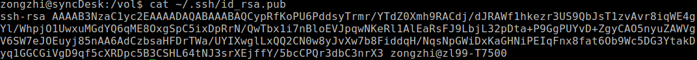
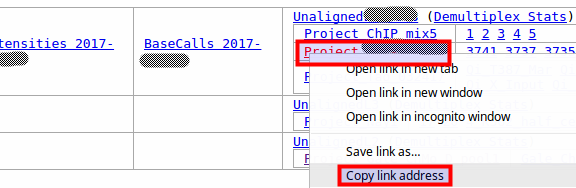

# RnaSeq-HpcPipelines
RNA-Seq Pipelines live on Yale HPC clusters. <br>
**Note about the `code block`s in this tutorial**:
- Each line is a bash command: program + options + arguments
- Anything after a `#` is a comment
- For most of the blocks, you can just copy and paste everything to your terminal, then type enter.
- The <span><ins>underlined part in a block<ins></span> need your action instead of just copy and paste. 
- You can type ctrl-c to cancel the execution of a command.

## 1. Prepare the unix terminal on your laptop/desktop
### For Windows users
- download and install [babun](http://babun.github.io/), a free cygwin based linux emulator.  Extract and run the install.bat file, it will take a few minutes. 
- And at last you will be at the terminal! You might want to pin it to the task bar (or search and run babun.bat later).
- Paste the following lines into your terminal (Babun Tip: mouse select text to copy, mouse right click to paste)
    ```sh
    babun update
    babun shell /bin/bash        #set bash as default shell
    ln -s $HOMEPATH/Downloads .  #make a shortcut of your Downloads folder
    ```
- Optional: Alternative unix terminals on windows:
    - Mobaxterm is another option which should suffice this tutorial.  You can download a free and portable (no installation needed) version [here](http://mobaxterm.mobatek.net/download-home-edition.html).
    - windows 10 users have another option to use 'subsystem for linux', [see here](https://www.howtogeek.com/249966/how-to-install-and-use-the-linux-bash-shell-on-windows-10/).

### For Mac OS X users
- Search and run terminal (you might want to pin it to your dock)
- Optional: Paste the following lines
    ```sh
    # install Homebrew, the popular free package manager for OSX. It will take a few minutes.
    ruby -e "$(curl -fsSL https://raw.githubusercontent.com/Homebrew/install/master/install)"
    brew install wget    #wget will be used later for downloading your RnaSeq data.
    ```
### Prepare your key files to yale clusters
- generate the key pair for your terminal:
    ```sh
    keyFile=~/.ssh/id_rsa
    # generate a key pair if necessary
    [[ -e $keyFile ]] || ssh-keygen -f $keyFile -t rsa -N ''
    chmod 600 $keyFile  #make your private key safe
    cat $keyFile.pub  #print your public key to screen
    ```
    Then copy the lines from your terminal starting from 'ssh-rsa', an example below:<br>
    
- Follow the link to [register your public key to yale HPC clusters](http://gold.hpc.yale.internal/cgi-bin/sshkeys.py), then
    - Paste into the input box, then click \<Make changes\>
Note: your need to prepare/register a key for each computer from which to logon to the cluster.

### Optional: Familiarize yourself with basic linux concepts and commands
This might looks overwhelming if your never use linux terminal, but it is rewarding. Set aside one hour to follow the tutorial to see how far you can go, you might find yourself at the end of the tutorial before the hour run off.
- [Command-line Bootcamp](http://rik.smith-unna.com/command_line_bootcamp) might be a good start.
- [See another tutorial here](http://www.ee.surrey.ac.uk/Teaching/Unix/index.html).

Excercise with the very basic linux commands (program + options + arguments), type each command except the <span><ins>italized part</ins></span> (you should act on it) and the comment (after #), followed by an enter.
- list the folders and files: ls
<pre>
ls
ls -l #long form: filesize, last modified time
ls -la #see the hidden: ., .., .ssh
ls --help
man ls #/ to search; arrows to navigate; q to quit
</pre>
- navigate in the tree: cd
<pre>
pwd  #find where you are
cd /  #go to root
ls -l
cd ~  #go to home, or just type cd
cd <ins>drag a folder from your file manager</ins> #go to a local folder
</pre>
- moving things around: mv, cp, mkdir
<pre>
cd
mkdir RnaseqTutorial
cd Rna<ins>click tab on yourkeyboard for autocompletion</ins>
cp ~/.ssh/id_rsa.pub . #. is for current directory
cd .. #.. is for parent directory
mv RnaseqTutorial ~/Downloads
ls ~/Downloads
<ins>up arrow to last command, then continue to type</ins>  | grep 'Rnaseq'  #| is call pipe, grep to filter lines
</pre>

## 2. Request and prepare your account on a yale HPC cluster
### Request an account 
- Go to [account request page of yale center for research computing](http://research.computing.yale.edu/support/hpc/account-reque
- check farnam, also check ruddle if you have sequenced on west campus/YCGA.
- it might takes a few work days for your accounts to be approved.

### First time logon and setup
- After you got the approvement email from ITS, log into your account from your terminal, example 
<pre>
ssh <ins>typeYourNetid</ins>@farnam.hpc.yale.edu
</pre>

- After you log onto the cluster, paste the following lines:
    ```sh
    # add pipelines folder to your command searching path
    echo 'export PATH="/home/zl99/code/ngs/pipelines:$PATH"' >> ~/.bashrc
    echo "alias prepare_pipelines='source /home/zl99/code/ngs/pipelines/prepare_pipelines.sh'" >> ~/.bashrc
    # make a tmux shortcut
    echo "alias tmuxa='tmux detach -a; tmux a || tmux new -s S0'" >> ~/.bashrc
    ls -l
    ```
    You can then exit by closing your terminal window or type `exit`.

Note for the HPC folders: 
    - project: 4T for the lab
    - scratch60: 10T for the lab, files stored here will be automaticly deleted after 60 days
    - In the following examples, most of results are stored under your scratch60 folder. See [FAQs](#faqs) to find how to backup/synchronize to your computer using `rsync`.
    
### Optional: Exercise with your basic linux commands
- Transfer a bunch of files: rsync
```sh
cd ~/project
rsync -azuvP /home/zl99/project/Project_Test1M .  #transfer all the Project_Test1M to current folder.
```
Tip for rsync: -a for all files; -z for fast transferring; -u for transferring files only if they are updated or new; -v for verbose (display more info); -P for progress (display a percentage transferred).
- View text file content: less
```sh
# continue from last block
cd Project_Test1M
ls * # * is wildcard representing anything
ls */*R1_001.fastq.gz # list only the first file from each sample
less Sample_10/10_002_CGATGT_L002_R1_001.fastq.gz
```
Tip for less: q to quit; arrows to navigate; / to search (then n to next match)

- Edit a text file: nano
```sh
# continue from last block
echo Sample* > exNano.csv  #echo just print strings to the screen
nano exNano.csv #try to add a comma and a group name (such as A,B) to each line
```
Tip for nano: ctrl-x to exit, then y followed enter to save.

## 3. Run RNA-Seq pipelines on a yale HPC cluster
- Log onto the cluster from your local terminal, example:
<pre>
ssh <ins>typeYourNetid</ins>@farnam.hpc.yale.edu
</pre>
- Run tmux: 
    ```sh
    tmuxa
    ```
    Note: We are using tmux primarily to keep your working processes running after you disconnect from the cluster. To detach from tmuxa, type ctrl-b then d. For more 'advanced' usage like tabs and panes, see my brief introduction to tmux in [FAQs](#faqs).
- To run one of the pipelines, request an interactive computing node with 8 CPUs, each with 4Gb Memory:
    - on farnam:
    ```sh
    srun --pty -c8 --mem-per-cpu=4000 bash
    ```
    - on ruddle:
    ```sh
    srun --pty -p interactive -c8 --mem-per-cpu=4000 bash
    ```
    Note: your will be kicked out of the the computing node after the 'walltime', which default to be 24 hours. 
- Then on your computing node, prepare the dependicies of the pipelines
    ```sh
    prepare_pipelines
    ```
### Mapping: Bowtie2 local single-end mapping pipeline
Generate a gene x sample read counts matrix for your project.

#### Test with the example project
- Set the parameters: paste the following lines in a computing node
    ```sh
    # set up the projectDir and genome
    zl99=$(realpath ~/../zl99)
    projectDir="$zl99/project/Project_Test1M"
    genome="hg38"
    ```
- Run the pipeline, output to a new folder under scratch60:
    ```sh
    # make a new folder in scratch60, cd there and do the mapping
    outDir="$HOME/scratch60/$(basename $projectDir).bowtie2"
    mkdir $outDir && cd $outDir && bowtie2localSeBatch $genome $projectDir
    ```
    It will take a few minutes.
- Optional: check the output of the pipeline. Examples:
    ```sh
    ls -l
    less geneCount.csv #q to quit
    ls -l */*.bam
    ```
    you can check the pipeline documents below for details.
    
#### Run your own project
- Follow link provided by the sequencing center, copy the link address of your project. Example:
, Then type
<pre>
projectLink="<ins>pastehere</ins>"
genome="<ins>type a genome version hg38 or mm10</ins>"
</pre>
- Then paste the following to set your projectDir and run the pipeline. It takes much longer, your might wait overnight.
    ```sh
    if [[ $HOSTNAME =~ 'ruddle' ]]; then
        projectDir="/sequencers/illumina${projectLink##*gpfs_illumina}"
    else
        projectDir=${projectLink##*dirName=}
    fi
        # make a new folder in scratch60, cd there and do the mapping
    outDir="$HOME/scratch60/$(basename $projectDir).bowtie2"
    mkdir $outDir && cd $outDir && bowtie2localSeBatch $genome $projectDir
    ```
- Tranfer the results to your computer: 
    - construct the rsync command on the cluster terminal: paster the following lines and copy the output:
   ```sh
   tmp=$USER@${HOSTNAME%%[0-9].*}.hpc.yale.edu
   echo "rsync -azvuP $tmp:$outDir ."
   ```
   Tip: to figure out the size of the outDir, type `cd $outDir; du -hs`.
    - open **your local terminal on your laptop** (Babun for windows, terminal for OSX), then type the following
<pre>
cd "<ins>drag to here a folder from your file manager, you might want to use one from an external drive</ins>"
<ins>paste your rsync command</ins>
</pre>

#### Pipeline Document:
- Usage: 
    `bowtie2localSeBatch <genome> <projectDir>`
- Arguments:
    * genome: one of {hg38, hg19, mm10, mm9}
    * projectDir: the Project folder with all you samples, each as folder with fastq.gz files.  Note that only R1 files are used for this single ended (Se) pipeline.
- Output: write to the current directory
    * a summary report of the mapping pipeline: summary.report.csv, summary.report.pdf
    * a count matrix of [geneId x sampleName]: geneCount.csv, geneInfo.csv
    * the normalized gene expression matrices: geneRpkm.csv, geneExpr.vst.csv
    * sample output folders, each with: 
        - BAM file: the alignments.
        - bigwig file: the coverage at each base normalized to Counts Per Million Reads mapped (CPM).

### Mapping: STAR + transcriptome mapping pipeline
TBD. High priority <br>
Reference: [STAR](https://github.com/alexdobin/STAR).

### Mapping: Tophat2 + transcriptome mapping pipeline
TBD. Low priority. <br>
Reference: [TopHat](https://ccb.jhu.edu/software/tophat/index.shtml).

### Diferential Expression: DESeq2 pipeline
#### Example/test usage
- Set the parameters: paste the following lines to your cluster terminal on a computing node
    ```sh
    # set up mappingDir and contrasts
    mappingDir="~/scratch60/Project_Test1M.bowtie2" #output directory of the mapping pipeline
    contrasts="A-Ctrl,B-Ctrl,B-A"
    ```
- Run pipeline, output to a new folder under your mappingFolder
    ```sh
    # run pipeline, output to a new folder ./deseq2
    mkdir $mappingDir/deseq2; cd $_
    prepare_pipelines
    deseq2ContrastBatch ../geneCount.csv ../sampleInfo.csv $contrasts
    ```
#### Run your project
- Set your mappingDir and contrasts as demonstrated in the example, replacing with your own setting after the `=`
- Create/upload your own sampleInfo.csv file to your mappingDir (check the format in the pipeline document below)
- Run the pipeline the same as in example
- Check the [FAQs](#faqs) if you want to download the results to your computer.

#### Pipeline Document
- Usage: `deseq2ContrastBatch <geneCountFile> <sampleInfoFile> <contrast1>[,<contrast2>[,...]]`
- Arguments:
    - geneCountFile: a csv file with raw read counts of geneID x sampleName
    - sampleInfoFile: a csv file with sample info. The first three columns are required.
        - sampleName should match that of geneCountFile
        - sampleShortName will be used in plots
        - sampleGroup will be used in a comparision/contrast.
    - a contrast: a comparison between two 'sampleGroup's in the format of groupNumerator-groupDenominator
- Output: write to the current directory
    - A normalized count matrix
    - PCA plot
    - Differential expression results as seperate folders, each for a comparison
        
Reference: [DESeq2 package](http://bioconductor.org/packages/release/bioc/html/DESeq2.html).

### Diferential Expression: VoomLimma diferential gene expression pipeline
TBD. Low priority <br>
Reference: [Limma package](https://bioconductor.org/packages/release/bioc/html/limma.html).

## FAQs
### How to synchronize files with the cluster?
You can use rsync, comes with the terminal on your computer. For example:
- set your remoteDir, localDir to synchronize
    ```sh
    remoteDir="yourNetid@farnam.hpc.yale.edu:scratch60"
    localDir="~/scratch60"
    ```
    Tip: you may drag your folder from your file explorer to the terminal to set the localDir.
- backup every file and subfolder from your remoteDir (source) to your localDir (target)
    ```sh
    rsync -azvuP $remoteDir/ $localDir # with /, transfer everything under the source dir.
    ```
- upload a new local folder named 'newFolder' (source) to your remoteDir (target)
    ```sh
    #upload a folder named 'newFolder' to your remoteDir
    rsync -azvuP $localDir/newFolder $remoteDir   #without /, transfer the source dir.
    ```
- For more usage examples of rsync, [see a tutorial](https://www.tecmint.com/rsync-local-remote-file-synchronization-commands/)

### How to bulk download you sequence files (fastq.gz) from west campus (on ruddle)
- Follow the download link provided in their email, copy the link address of your project. Example:


- set the projectLink, netId, targetDir on your local terminal
<pre>
projectLink="<ins>pastehere</ins>"
targetDir="<ins>type or drag a folder on your computer, can be an external hard drive</ins>"
netId=<ins>type your netid</ins>
</pre>
- Download with rsync
    ```sh
    projectDir="/sequencers/illumina${projectLink##*gpfs_illumina}"
    rsync -azvuP $netId@ruddle.hpc.yale.edu:$projectDir $targetDir
    ```
<!--
- Alternatively, if you do not have an account on ruddle. Email to ask for an external link, copy the link address, then
    - set the externalLink and targetDir: replace with your settings
        ```sh
        externalLink=__pastehere__
        targetDir=~/Downloads
        ```
    - Download with wget: paste the following
        ```sh
        cd $targetDir
        wget -e robots=off -r --accept *.fastq.gz $externalLink       ```
-->
### How to bulk download sequence files (fastq) from Yale Stem Cell Center (on farnam)
- follow the download link provided in their email, copy the link address of your project.
- set the projectLink, targetDir, and netId, as shown in the section above    
- Download with rsync: paste the following lines
    ```sh
    projectDir=${projectLink##*dirName=}
    rsync -azvuP --exclude='*.fastq' $netId@farnam.hpc.yale.edu:$projectDir $targetDir
    ```
<!--
- Alternatively, if you do not have a farnam account:
    - set the projectLink, targetDir as above
    - Download with wget: paste the following lines
    ```sh
    projectDir=${projectLink##*dirName=}
    cd $targetDir
    wget -e robots=off -r --accept *.fastq.gz http://futo.cs.yale.edu:16023/$projectDir
```
-->   
### How to perform basic Quality analyses to the raw data?
Use [fastqc](https://www.bioinformatics.babraham.ac.uk/projects/fastqc/)
- run the run_fastqc.bat after downloaded and extracted. You might want to add a shortcut to your Desktop.
  - Menu : file to open one of a fasta.gz file.
  - Menu : file to save report.
- You can find tutorial and examples on the [fastqc website](https://www.bioinformatics.babraham.ac.uk/projects/fastqc/).
- Mac tip: you might want to allow the software by [System preferences - security - open anyway].

### How to visualize the bigwig (.bw) files for each sample?
- You can use IGV, [see here](http://software.broadinstitute.org/software/igv/)

### Tmux: why to use and how?
- Why whould i use tmux?
    - keep programs running after you disconnect (e.g. when working on a remote server via ssh)
    - split your terminal into windows(tabs) and panes (multple terminals within a window/tab) <br>
    

- Using tabs: once in tmux, type ctrl-b then

    |type a key  |to |
    |----:|-----|
    |c              |create a new window (you might call it a tab) |
    |n / number     |select next/specific window |
    |x              |kill the current pane |
    
- More advanced: Using panes 
    
    |type ctrl-b, then | to |
    | ---: | --- |
    |" / %            |create a new pane vertically/horizontally |
    |o / arrow   |select next/specific pane |
    |ctrl+arrow  |resize a pane |
    |z  |toggle maximize/unmaximize a pane |
    |d  |detach and leave everthing running in the background |
    |?              |see a shortcut list |
    
### What are the first linux commands should I learn?
- essential commands
  - navigation: ls, cd, mkdir, rmdir, cp, mv, ln, rm
  - view/edit: cat, less, echo, nano
  - file transfer: rsync, wget
- concepts and operators:
  - wildcards: \*, ?
  - variable: ${}
  - redirect: |, >, >>

### How to move and rename nested files to one folder?
- You can use a for loop, for example
  ```
  # move each sorted.bam.bw in the subfolders to the current folder and rename as the_subfolder.bw
  for f in */*.bw; do mv $f ${f/\/sorted.bam/}; done
  ```
  - `${string/pattern/replacement}` is a [bash string manipulation](http://www.thegeekstuff.com/2010/07/bash-string-manipulation). The pattern will be deleted without replacement.

### How to filter the gene count data by an arbitrary criteria?
You can do this in a spreadsheet.  An autofilter following [countif function](https://www.ablebits.com/office-addins-blog/2014/07/02/excel-countif-examples/) might suffice.


